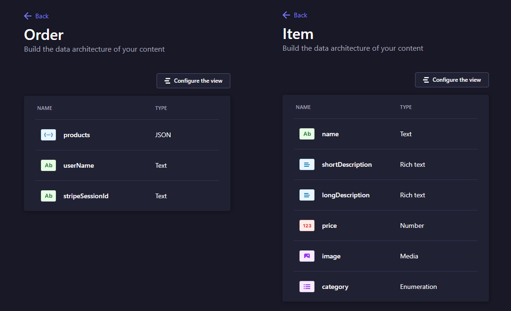

# Ecommerce functionality

## Features

- carousel slideshow
- home page with product list and categories
- responsiveness
- footer
- subscribe field
- product pages with related products listed
- cart menu modal
- checkout page
- multi-step forms
- stripe payment
- strapi backend

## Data modeling

There are two collections screated via Strapo Dashboard Content-Type Builder. Those are Item and Order collections.

## Technologies used

- React
  - React Router for navigation,
  - Formik & Yup to handle forms and validation,
  - Redux for state management,
  - Redux Toolkit for Redux setup,
  - MUI for easy to setup Material UI and components,
- Node
  - Strapi as our API framework of choice for backend,
- Stripe
  - Payment API

## Application Preview

### Other views

[cart](cart.png)
[checkout](checkout.png)
[product](product.png)

## Credits

Project based on [EdRoh](https://www.youtube.com/@EdRohDev) fullstack tutorial.
